# Setup tool for automatic install applications in RIPT Lab

This tools using a Ubuntu machine as Server to install packages, execute shell commands, file transfer to Windows machines

## 0. UBUNTU - Install requirements

```bash
sudo snap install ansible
pip install pywinrm --upgrade
ansible-galaxy collection install chocolatey.chocolatey
ansible-galaxy collection install ansible.windows
```

## 1. WINDOWS - Create new account

- Open `File Explorer`
- Right click on `This PC` and select `Manage` \
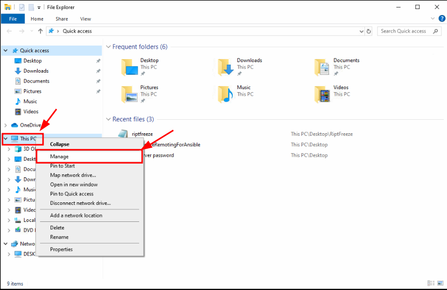
- In `Local Users and Groups`, select `Users` \
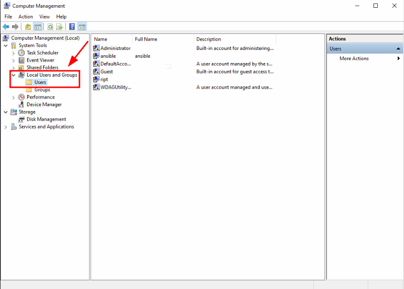
- Right click in any space and select `New User...` \
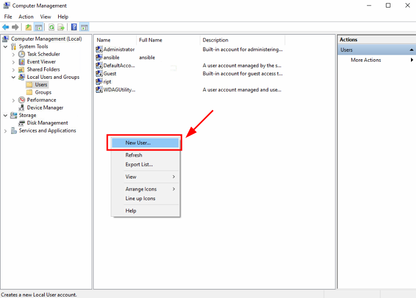
- Fill the information and click on `Create` \
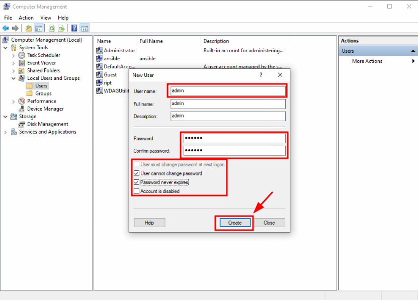
- In `Local Users and Groups`, select `Groups` \
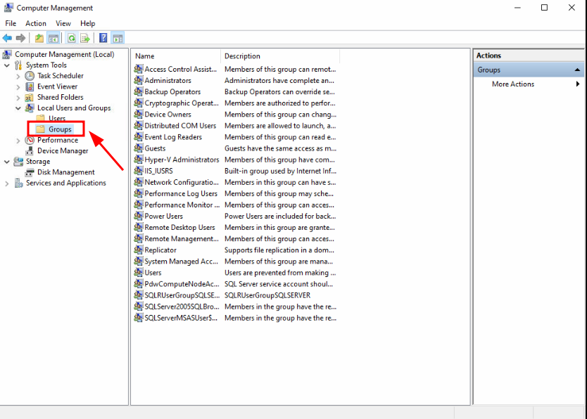
- Right click on `Administrators` and select `Add to Group...` \
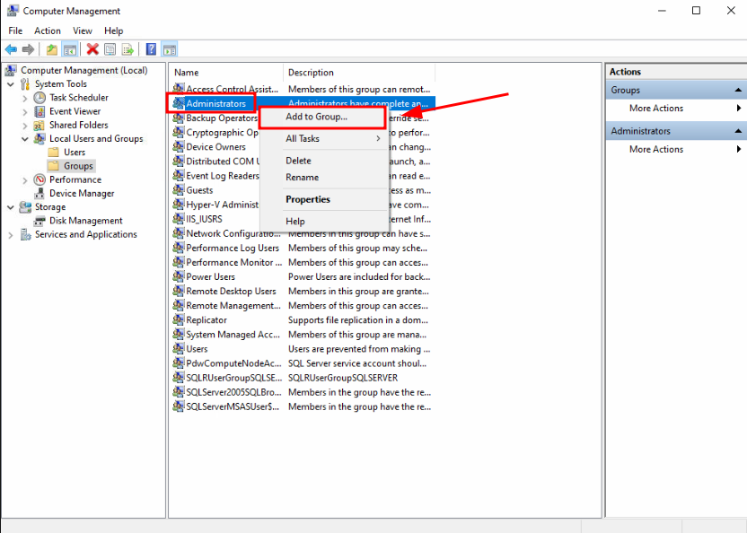
- Click on `Add` \
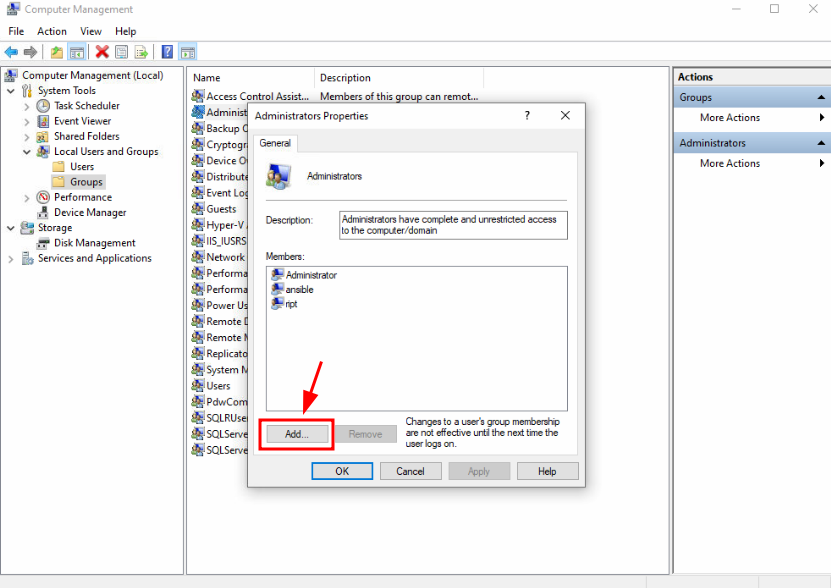
- Type username in text area, click on `Check Names`, then click on `OK` \
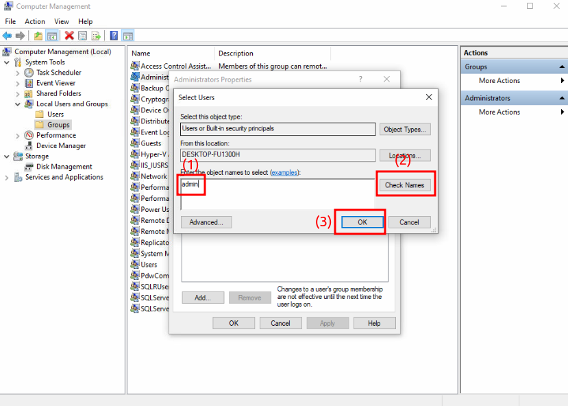
- Click on `Apply`, then click on `OK` \
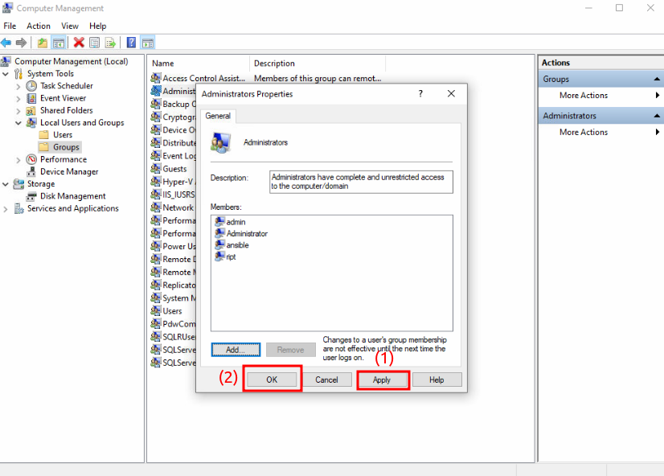

***`NOTE: Account and password in aal machines have to be the same!!!`***

## 2. WINDOWS - Install .NET 4

- Open `Turn Windows Features on or off` \
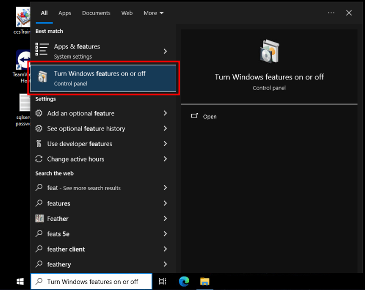
- Check on all checkbox in 2 `.NET` options, then click on `OK` \
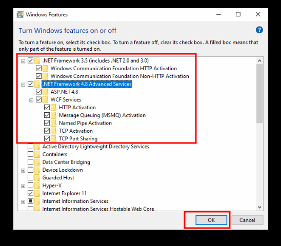

## 3. WINDOWS - Open Power Shell with administrator privileges

## 4. WINDOWS - Allow `.ps1` file run on your system

```bash
Set-ExecutionPolicy -ExecutionPolicy Unrestricted
```

## 5. WINDOWS - Run `install.ps1`

```bash
./install.ps1
```

Type ***Y*** in all questions.

## 6. WINDOWS - Run `config.ps1`

```bash
./config.ps1
```

Type ***R*** in questions.

## 6. UBUNTU - Add all IPv4 of machines to `host.ini`

## 7. UBUNTU - Modify file `install.yml` to add needed packages

Refer to [this link](https://community.chocolatey.org/packages)

## 8. UBUNTU - Run file `install.yml` with ansible-playbook

```bash
ansible-playbook -i host.ini install.yml -vvvv
```
